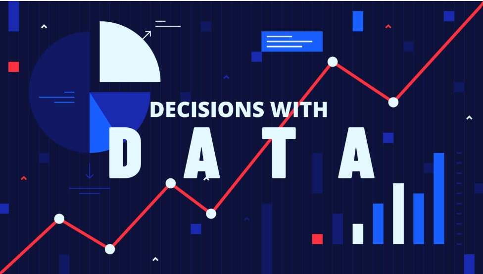

<!-- MASTER REGISTER INPUT RADIO CONTROLLERS -->
<input type="radio" name="page-tabs" id="tab-home" class="tab-toggle" checked />
<input type="radio" name="page-tabs" id="tab-about" class="tab-toggle" />
<input type="radio" name="page-tabs" id="tab-services" class="tab-toggle" />
<input type="radio" name="page-tabs" id="tab-projects" class="tab-toggle" />
<input type="radio" name="page-tabs" id="tab-portfolio" class="tab-toggle" />
<input type="radio" name="page-tabs" id="tab-experience" class="tab-toggle" />
<input type="radio" name="page-tabs" id="tab-education" class="tab-toggle" />
<input type="radio" name="page-tabs" id="tab-certifications" class="tab-toggle" />
<input type="radio" name="page-tabs" id="tab-get-in-touch" class="tab-toggle" />

<!-- FIXED EDGE-TO-EDGE TOP HEADER BLOCK AND NAVIGATION CONTROL BAR -->

  

    <h1>Edna Ogutu | KenData Consultant</h1>
  

  

    <label for="tab-home"> HOME</label>
    <label for="tab-about"> ABOUT</label>
    <label for="tab-services"> SERVICES</label>
    <label for="tab-projects"> PROJECTS</label>
    <label for="tab-portfolio"> PORTFOLIO</label>
    <label for="tab-experience"> EXPERIENCE</label>
    <label for="tab-education"> EDUCATION</label>
    <label for="tab-certifications"> CERTIFICATIONS</label>
    <label for="tab-get-in-touch"> GET IN TOUCH</label>
  

<!-- FIXED EDGE-TO-EDGE BOTTOM FROZEN FOOTER BAR -->

  

    
 Nairobi, Kenya | 💬 <a href="https://whatsapp.com" target="_blank">WhatsApp: +254 741 937074</a>

    
 <a href="https://www.linkedin.com/in/edna-achieng-ogutu/" target="_blank">Connect on LinkedIn</a>

  

<!-- ================================================ -->
<!-- 1. HOME CARD                                     -->
<!-- ================================================ -->

  

    
    <!-- LEFT PANEL: DATA GRAPHIC CANVAS CONTAINER (COMPACT FRAME SCALE) -->
    

      
    

    
    <!-- RIGHT PANEL: NAME & HEADLINES (VERTICALLY CENTERED WITH TIGHT RESOLVED WIDTH) -->
    

      <h2 style="color: #23272A !important; font-size: 26px !important; font-weight: 900 !important; border-bottom: 4px solid #23272A !important; margin: 0 0 12px 0 !important; padding-bottom: 6px !important; text-transform: uppercase !important; display: block !important;"> Home</h2>
      
Edna Ogutu

      
Statistician | Data Analyst | Business Intelligence | Data Science | Workforce Analytics

      
I engineer robust data pipelines, statistical frameworks, and automated dashboards that eliminate operational reporting blind spots, protect corporate budgets, and drive decision-ready intelligence.

    

    
  

  <!-- TEXT BLOCK AUTOMATICALLY FLOWING ENTIRELY BELOW THE IMAGE ROW -->
  

    
I am a Statistician and Data Analyst with a deep background in Biostatistics and experience working with workforce tracking metrics, research diagnostics, operational flows, survey matrices, and commercial business data. By bridging the gap between raw data complexity and executive strategy, I combine advanced data management, descriptive and inferential statistics, and modern business intelligence to transform disorganized data streams into high-integrity information, clear operational insights, and decision-ready executive reporting.

    
    
 Explore My Portfolio: <label for="tab-projects" style="color: #1A488E; cursor: pointer; text-decoration: underline; font-weight: bold;">View Selected Projects Frameworks</label> | <label for="tab-services" style="color: #1A488E; cursor: pointer; text-decoration: underline; font-weight: bold;">Explore Specialized Analytics Services</label> | <label for="tab-get-in-touch" style="color: #1A488E; cursor: pointer; text-decoration: underline; font-weight: bold;">Schedule a Data Solutions Consultation Session</label>

  

<!-- ================================================ -->
<!-- 2. ABOUT CARD                                    -->
<!-- ================================================ -->

  

    
    <!-- LEFT PANEL: DATA GRAPHIC CONTAINER (REDUCED TO MATCH COMPACT PORTFOLIO DESIGN) -->
    

      
    

    
  <!-- RIGHT PANEL: CONTENT & VALUE PROPOSITION (VERTICALLY RE-CENTERED) -->

  <h2 style="color: #23272A !important; font-size: 26px !important; font-weight: 900 !important; border-bottom: 4px solid #23272A !important; margin: 0 0 12px 0 !important; padding-bottom: 6px !important; text-transform: uppercase !important; display: block !important;"> About Me</h2>
  
I bridge the structural gap between messy, multi-source raw data and high-stakes executive strategy.

  
My approach is centered on building high-integrity validation checks at the collection source, ensuring that every predictive model, regression script, or visualization dashboard is mathematically sound, audit-ready, and immediately actionable for corporate decision-makers.

  
  <!-- STRATEGIC VALUE PROPOSITION BULLET LIST -->
  <ul style="padding-left: 20px !important; margin-top: 12px !important; margin-bottom: 0 !important; list-style-type: square !important;">
    <li style="font-size: 14.5px !important; line-height: 1.5 !important; color: #1A1D20 !important; font-weight: 500; margin-bottom: 8px !important;">
      <b>End-to-End Execution:</b> Operating across the entire analytical pipeline—from executing rigorous data cleaning and cross-system reconciliations to formulating diagnostic models and interactive reporting systems.
    </li>
    <li style="font-size: 14.5px !important; line-height: 1.5 !important; color: #1A1D20 !important; font-weight: 500; margin-bottom: 8px !important;">
      <b>Strategic Transformation:</b> Transforming highly complex numbers into simple, actionable, and strategic next steps for senior leadership.
    </li>
    <li style="font-size: 14.5px !important; line-height: 1.5 !important; color: #1A1D20 !important; font-weight: 500; margin-bottom: 0 !important;">
      <b>Data-Driven Efficiencies:</b> Grounding metrics in high-integrity data quality and asking the right analytical questions to generate long-term operational efficiencies.
    </li>
  </ul>

 <!-- Safely closes the top horizontal flex introduction row container block -->

  <!-- LOWER SECTION: FULL WIDTH ALIGNED COMPETENCIES MATRIX GRID -->
  

    <h3 style="margin-top: 0 !important; margin-bottom: 15px !important; font-size: 20px; font-weight: 900; color: #23272A !important; border-bottom: 2px solid rgba(35,39,42,0.15); padding-bottom: 6px; text-transform: uppercase; letter-spacing: 0.5px;"> Core Execution Domains</h3>
    
    

      
      <!-- BOX 1: DATA ANALYTICS -->
      

         1. Data Analytics & Modeling
        <ul style="padding-left: 20px !important; margin: 0 !important; list-style-type: square !important;">
          <li style="font-size: 13px !important; line-height: 1.4 !important; color: #2D3748 !important; font-weight: 500; margin-bottom: 4px !important;">Designing and deploying custom corporate KPI matrix tracking frameworks.</li>
          <li style="font-size: 13px !important; line-height: 1.4 !important; color: #2D3748 !important; font-weight: 500; margin-bottom: 4px !important;">Executing comprehensive exploratory data analysis (EDA) algorithms.</li>
          <li style="font-size: 13px !important; line-height: 1.4 !important; color: #2D3748 !important; font-weight: 500; margin-bottom: 0 !important;">Formulating historical trend forecasting and performance trend lines.</li>
        </ul>
      

      <!-- BOX 2: DATA ENGINEERING -->
      

         2. Data Engineering & Management
        <ul style="padding-left: 20px !important; margin: 0 !important; list-style-type: square !important;">
          <li style="font-size: 13px !important; line-height: 1.4 !important; color: #2D3748 !important; font-weight: 500; margin-bottom: 4px !important;">Architecting automated structural cleaning and parsing routines.</li>
          <li style="font-size: 13px !important; line-height: 1.4 !important; color: #2D3748 !important; font-weight: 500; margin-bottom: 4px !important;">Enforcing cross-source database records validation parameters.</li>
          <li style="font-size: 13px !important; line-height: 1.4 !important; color: #2D3748 !important; font-weight: 500; margin-bottom: 0 !important;">Executing multi-tier system ledger reconciliation and preparation.</li>
        </ul>
      

      <!-- BOX 3: STATISTICAL INFERENCE -->
      

         3. Statistical Inference & Research
        <ul style="padding-left: 20px !important; margin: 0 !important; list-style-type: square !important;">
          <li style="font-size: 13px !important; line-height: 1.4 !important; color: #2D3748 !important; font-weight: 500; margin-bottom: 4px !important;">Applying complex descriptive summaries and inferential metrics testing.</li>
          <li style="font-size: 13px !important; line-height: 1.4 !important; color: #2D3748 !important; font-weight: 500; margin-bottom: 4px !important;">Constructing multivariable linear and logistic regression models.</li>
          <li style="font-size: 13px !important; line-height: 1.4 !important; color: #2D3748 !important; font-weight: 500; margin-bottom: 0 !important;">Synthesizing field diagnostic evidence for strategic decision-making.</li>
        </ul>
      

         <!-- BOX 4: BUSINESS INTELLIGENCE (NESTED CORRECTLY INSIDE THE CORE DOMAINS PARENT ROW) -->
      

         4. Business Intelligence Systems
        <ul style="padding-left: 20px !important; margin: 0 !important; list-style-type: square !important;">
          <li style="font-size: 13px !important; line-height: 1.4 !important; color: #2D3748 !important; font-weight: 500; margin-bottom: 4px !important;">Engineering interactive, responsive Power BI business dashboards.</li>
          <li style="font-size: 13px !important; line-height: 1.4 !important; color: #2D3748 !important; font-weight: 500; margin-bottom: 4px !important;">Formulating corporate cross-filtering visual performance matrix maps.</li>
          <li style="font-size: 13px !important; line-height: 1.4 !important; color: #2D3748 !important; font-weight: 500; margin-bottom: 0 !important;">Generating automated executive management reporting frameworks.</li>
        </ul>
      

    
 <!-- Safely closes the single parent display grid container row -->

    <!-- RE-ENGINEERED OPTIMIZED TOOLSTACK RIBBON WITH CLEAN WRAPPING & LEGIBLE CONTRAST -->
    

       Statistical Tools Mastered
      
        Excel &nbsp;|&nbsp; Power Query &nbsp;|&nbsp; Power BI &nbsp;|&nbsp; DAX &nbsp;|&nbsp; SQL &nbsp;|&nbsp; Python &nbsp;|&nbsp; R &nbsp;|&nbsp; STATA &nbsp;|&nbsp; SPSS
      
    

  
 <!-- Safely closes the internal padding card content flex framework -->

 <!-- Safely closes the ABOUT Content Card Wrapper container box perfectly -->

<!-- ================================================ -->
<!-- 3. SERVICES CARD                                 -->
<!-- ================================================ -->

  <h2>💼 Operational Consulting Services</h2>
  
Speaking directly to organizational pain points—substituting manual error with high-integrity automation:

  
  <!-- PERSUASIVE BENTO GRID SYSTEM WITH NEW STRATEGIC CONTENT -->
  

    
    <!-- CARD 1: ENTERPRISE DATA ANALYTICS -->
    

      💼
      Enterprise Data Analytics
      
I engineer scalable analytics frameworks that bridge the gap between complex enterprise operations and clear corporate strategy.

      <ul style="padding-left: 20px !important; margin: 0 !important; list-style-type: square !important;">
        <li style="font-size: 13px !important; line-height: 1.45 !important; color: #2D3748 !important; font-weight: 500; margin-bottom: 6px !important;"><b>Commercial Insights:</b> Transforming fragmented, cross-departmental data streams into clear localized market trends and actionable growth opportunities.</li>
        <li style="font-size: 13px !important; line-height: 1.45 !important; color: #2D3748 !important; font-weight: 500; margin-bottom: 0 !important;"><b>Performance Benchmarking:</b> Mapping disparate data pipelines into high-visibility corporate performance indicators (KPIs) to track organizational health in real time.</li>
      </ul>
    

    <!-- CARD 2: DATABASE VALIDATION & AUDITING -->
    

      🔍
      Database Validation & Auditing
      
I deploy rigorous data governance protocols to establish a single, trusted source of truth for your business architecture.

      <ul style="padding-left: 20px !important; margin: 0 !important; list-style-type: square !important;">
        <li style="font-size: 13px !important; line-height: 1.45 !important; color: #2D3748 !important; font-weight: 500; margin-bottom: 6px !important;"><b>Automated Data Cleaning:</b> Designing custom validation routines that dynamically fix syntax discrepancies and catch format anomalies.</li>
        <li style="font-size: 13px !important; line-height: 1.45 !important; color: #2D3748 !important; font-weight: 500; margin-bottom: 0 !important;"><b>Ledger Reconciliation:</b> Engineering cross-system auditing rules to completely eliminate duplicate tracking records and permanently isolate data leakages.</li>
      </ul>
    

    <!-- CARD 3: EXECUTIVE BUSINESS INTELLIGENCE -->
    

      📊
      Executive Business Intelligence
      
I build high-impact visualization ecosystems that democratize data access and drive rapid executive decision-making.

      <ul style="padding-left: 20px !important; margin: 0 !important; list-style-type: square !important;">
        <li style="font-size: 13px !important; line-height: 1.45 !important; color: #2D3748 !important; font-weight: 500; margin-bottom: 6px !important;"><b>Dashboard Engineering:</b> Designing responsive Power BI and Advanced Excel suites tailored for immediate operational oversight.</li>
        <li style="font-size: 13px !important; line-height: 1.45 !important; color: #2D3748 !important; font-weight: 500; margin-bottom: 0 !important;"><b>Live Decision Support:</b> Integrating interactive parameters, dynamic filtering, and deep drill-down analytics for friction-free reporting.</li>
      </ul>
    

    <!-- CARD 4: ADVANCED COMMERCIAL ANALYTICS -->
    

      📈
      Advanced Commercial Analytics
      
I apply advanced machine learning frameworks to customer data to optimize monetization, mitigate risk, and project revenue.

      <ul style="padding-left: 20px !important; margin: 0 !important; list-style-type: square !important;">
        <li style="font-size: 13px !important; line-height: 1.45 !important; color: #2D3748 !important; font-weight: 500; margin-bottom: 6px !important;"><b>Behavioral Segmentation:</b> Deploying multi-dimensional customer matrices and Recency, Frequency, Monetary (RFM) clustering profiles.</li>
        <li style="font-size: 13px !important; line-height: 1.45 !important; color: #2D3748 !important; font-weight: 500; margin-bottom: 0 !important;"><b>Predictive Risk Modeling:</b> Building supervised machine learning pipelines to forecast market shifts, flag churn risks, and drive proactive strategy.</li>
      </ul>
    

    <!-- CARD 5: STATISTICAL RESEARCH & CONTROLS -->
    

      🔬
      Statistical Research & Controls
      
I leverage rigorous academic and empirical methodologies to ensure your research outcomes are bulletproof and mathematically sound.

      <ul style="padding-left: 20px !important; margin: 0 !important; list-style-type: square !important;">
        <li style="font-size: 13px !important; line-height: 1.45 !important; color: #2D3748 !important; font-weight: 500; margin-bottom: 6px !important;"><b>Quantitative Modeling:</b> Applying advanced population sampling controls, experimental regressions, and variance analysis (ANOVA) to survey datasets.</li>
        <li style="font-size: 13px !important; line-height: 1.45 !important; color: #2D3748 !important; font-weight: 500; margin-bottom: 0 !important;"><b>Evidence-Based Reporting:</b> Synthesizing complex field data and deep analytics into defensible, high-integrity executive reports for stakeholders.</li>
      </ul>
    

  

  <!-- HIGH-CONTRAST ACTION ACCENT BUTTON BAR (PORTFOLIO SYNOPSES GATE) -->
  

    

      🛠️ Portfolio Synopses: <label for="tab-projects" style="color: #FFD200; cursor: pointer; text-decoration: underline; font-weight: 900; margin-left: 5px;">Examine the active project briefs and structural overviews demonstrating these services in production →</label>
    

  

<!-- ================================================ -->
<!-- 4. PROJECTS CARD                                 -->
<!-- ================================================ -->

  <h2> Selected Projects Portfolio</h2>
  
A directory of production-ready analytical systems designed to optimize business operations, increase tracking visibility, and automate multi-source data processing pipelines using a protective synopsis format:

  <!-- PROJECT 1 -->
  

    
 1. Workforce & HR Analytics System

    

      
<b> Project Synopsis:</b> Developed an interactive workforce analytics system to transform fragmented employee records into management-ready insights tracking workforce composition, departmental distributions, salary bands, and performance metrics across large employee cohorts.

      
<b> Analytical Focus:</b> Workforce scale tracking | Department and role distribution | Salary compression and equity patterns | Shift performance variables | Attrition and stability trends.

      
<b> Specialized Tools Stack:</b> Excel | Power Query | Power BI | DAX | Statistical Analysis

      
<b> Strategic Value & Output:</b> Interactive Power BI report dashboard featuring multi-dimensional cross-filtering. Delivers a consolidated view of workforce health parameters to support executive monitoring, compliance audits, and strategic resource forecasting.

    

  

  <!-- PROJECT 2 -->
  

    
 2. Data Quality & Reconciliation Engine

    

      
<b> Project Synopsis:</b> Architected a data validation and reconciliation module to ingest multi-source administrative files, isolate structural data discrepancies, match missing parameters, and compile a verified clean database for secure corporate financial reporting.

      
<b> Analytical Focus:</b> Data completeness metrics | Duplicate and missing-value isolation | Cross-system key matching | Automated ledger reconciliation | Schema standardization | Exception reporting logs.

      
<b> Specialized Tools Stack:</b> Excel | Power Query | SQL | Python | Statistical Analysis

      
<b> Strategic Value & Output:</b> A fully validated, reconciled relational dataset backed by automated exception tracking scripts. Mitigates financial and reporting risk by identifying and resolving structural database anomalies before files are used for audits.

    

  

  <!-- PROJECT 3 -->
  

    
 3. Employee Engagement & Statistical Analytics

    

      
<b> Project Synopsis:</b> Engineered a quantitative survey analytics system to process corporate sentiment tracking files, evaluating feedback distributions, response behaviors, and demographic correlations across dynamic organizational blocks.

      
<b> Analytical Focus:</b> Engagement pattern tracking | Survey response trends | Cohort sentiment analysis | Multi-variable correlation | Descriptive and inferential statistics diagnostics | Analytical data visualization.

      
<b> Specialized Tools Stack:</b> Excel | Power Query | Power BI | Python / R | Statistical Analysis

      
<b> Strategic Value & Output:</b> Interactive sentiment matrix dashboard supported by inferential statistical tests. Translates raw Likert-scale feedback metrics into structured evidence to support proactive team management and isolate operational friction points.

    

  

  <!-- PROJECT 4 -->
  

    
 4. Customer & Commercial Predictive Analytics

    

      
<b> Project Synopsis:</b> Developed an end-to-end commercial optimization pipeline using business transactions to group buyer cohorts and apply supervised machine learning classification algorithms to predict churn risks.

      
<b> Analytical Focus:</b> Purchasing pattern trends | Gross profit margins % | Customer behavioral segmentation | Customer Lifetime Value (CLV) tracks | Supervised predictive modeling | Model precision and performance evaluation.

      
<b> Specialized Tools Stack:</b> Excel | SQL | Python | Power BI | Scikit-Learn

      
<b> Strategic Value & Output:</b> Enterprise business intelligence dashboard connected directly to statistical clustering and churn risk classifiers. Combines visual reporting with advanced predictive diagnostics to identify high-value customer groups and mitigate revenue drop-offs.

    

  

<!-- ================================================ -->
<!-- 5. PORTFOLIO CARD                                -->
<!-- ================================================ -->

  <h2> Portfolio Directory</h2>
  
A directory summarizing alignment profiles and operational capability targets for my core data modules:

  
  

    <table style="width: 100% !important; min-width: 950px !important; border-collapse: collapse !important; background-color: #FFFFFF !important; color: #23272A !important; font-size: 13.5px !important; margin: 0;">
      <thead>
        <tr style="background-color: #23272A !important; color: #FFFFFF !important; font-weight: bold;">
          <th style="padding: 14px 10px; border-right: 1px solid #3A3F44; text-align: center; width: 4%;">#</th>
          <th style="padding: 14px 12px; border-right: 1px solid #3A3F44; text-align: left; width: 22%;">Venture Track Name Focus</th>
          <th style="padding: 14px 12px; border-right: 1px solid #3A3F44; text-align: left; width: 18%;">Specialized Tools Stack</th>
          <th style="padding: 14px 12px; border-right: 1px solid #3A3F44; text-align: left; width: 26%;">Core Enterprise Metrics Deployed</th>
          <th style="padding: 14px 12px; text-align: left; width: 30%;">Target Operational Capability Value</th>
        </tr>
      </thead>
      <tbody>
        <tr style="background-color: #FFFFFF; border-bottom: 1px solid #E2E8F0;">
          <td style="padding: 14px 10px; border-right: 1px solid #E2E8F0; text-align: center; font-weight: bold; color: #4A5568;">1</td>
          <td style="padding: 14px 12px; border-right: 1px solid #E2E8F0; font-weight: bold; color: #1A488E;">Workforce & HR Analytics</td>
          <td style="padding: 14px 12px; border-right: 1px solid #E2E8F0;">Excel, Power Query, Power BI, DAX</td>
          <td style="padding: 14px 12px; border-right: 1px solid #E2E8F0;">Headcount, Department Distribution, Attrition Rate</td>
          <td style="padding: 14px 12px; font-weight: 500;">Analytical Modelling, KPI Development, Corporate Management Reporting</td>
        </tr>
        <tr style="background-color: #F8FAFC; border-bottom: 1px solid #E2E8F0;">
          <td style="padding: 14px 10px; border-right: 1px solid #E2E8F0; text-align: center; font-weight: bold; color: #4A5568;">2</td>
          <td style="padding: 14px 12px; border-right: 1px solid #E2E8F0; font-weight: bold; color: #1A488E;">Data Quality & Reconciliation</td>
          <td style="padding: 14px 12px; border-right: 1px solid #E2E8F0;">Excel, Power Query, SQL, Python</td>
          <td style="padding: 14px 12px; border-right: 1px solid #E2E8F0;">Record Completeness, Duplicate Tracking, Gaps Validation</td>
          <td style="padding: 14px 12px; font-weight: 500;">Cross-Source Record Matching, Dataset Cleaning, Exception Reporting</td>
        </tr>
        <tr style="background-color: #FFFFFF; border-bottom: 1px solid #E2E8F0;">
          <td style="padding: 14px 10px; border-right: 1px solid #E2E8F0; text-align: center; font-weight: bold; color: #4A5568;">3</td>
                    <td style="padding: 14px 12px; border-right: 1px solid #E2E8F0; font-weight: bold; color: #1A488E;">Employee Survey Analytics</td>
          <td style="padding: 14px 12px; border-right: 1px solid #E2E8F0; color: #2D3748;">Excel, Power BI, Python, R</td>
          <td style="padding: 14px 12px; border-right: 1px solid #E2E8F0; color: #2D3748;">Engagement Score, Response Rates, Variable Correlations</td>
          <td style="padding: 14px 12px; font-weight: 500;">Inferential Statistics, Survey Array Processing, Evidence-Based Insights</td>
        </tr>
        <tr style="background-color: #F8FAFC; border-bottom: 0;">
          <td style="padding: 14px 10px; border-right: 1px solid #E2E8F0; text-align: center; font-weight: bold; color: #4A5568;">4</td>
          <td style="padding: 14px 12px; border-right: 1px solid #E2E8F0; font-weight: bold; color: #1A488E;">Customer & Commercial Analytics</td>
          <td style="padding: 14px 12px; border-right: 1px solid #E2E8F0; color: #2D3748;">Excel, SQL, Python, Power BI, scikit-learn</td>
          <td style="padding: 14px 12px; border-right: 1px solid #E2E8F0; color: #2D3748;">Purchasing Patterns, CLV, Predictive Churn Probability</td>
          <td style="padding: 14px 12px; font-weight: 500;">Customer Behavior Segmentation, Supervised ML, Business Intelligence Support</td>
        </tr>
      </tbody>
    </table>
  

<!-- ================================================ -->
<!-- 6. EXPERIENCE CARD                               -->
<!-- ================================================ -->

  <h2> Experience</h2>
  <h3 style="margin-top: 0 !important;">Professional Experience</h3>
  
My consulting track spans data engineering, workforce analytics, research operations, and quantitative biostatistics across research, corporate, and international development environments.

  <h3> Data Analyst - Infotrak Research & Consulting</h3>
  Active Engagement Track - (2026)
  <ul>
    <li>Managing research, survey, and commercial business data pipelines across end-to-end data management, data validation, inferential statistical testing, and executive reporting.</li>
    <li>Automating the transformation of massive raw field research tracking arrays into high-integrity, decision-ready information assets for strategic stakeholders.</li>
  </ul>

  <h3> Workforce & Data Analyst - Calltronix Kenya Ltd</h3>
  Corporate Operations Track - (2024–2025)
  <ul>
    <li>Analysed and reconciled cross-functional workforce, HR, finance, and system operations data to audit productivity, validate incentive parameters, and support payroll processing for 350+ FTE.</li>
    <li>Integrated multiple disjointed operational data platforms to eliminate tracking variances and generate automated performance dashboards for leadership.</li>
  </ul>

  <h3> Data & Research Analyst - Hamasisha Africa</h3>
  Research Systems Analyst Track - (2025)
  <ul>
    <li>Supported quantitative project research through data preparation, multi-variable statistical analysis, narrative interpretation, and stakeholder reporting, directly enabling evidence-based funding deployments.</li>
  </ul>

  <h3> Research, MEAL & Data Assignments - Various Projects</h3>
  Independent Field Consultations Track
  <ul>
    <li>Undertook specialized contract assignments involving quantitative data capture monitoring, digital questionnaire skip-logic engineering, descriptive summaries, and field-based information management.</li>
  </ul>

  
  
 Primary Specialty Fields: Data Analytics | Statistics | Business Intelligence | Data Management | Research Analytics | Workforce Analytics

<!-- ================================================ -->
<!-- 7. EDUCATION CARD                                -->
<!-- ================================================ -->

  <h2> Education</h2>
  
  <h3> Master of Science in Data Science</h3>
  Open University of Kenya - (Ongoing / In Progress)
  

    <b> Advanced Graduate Competencies:</b> Active development of advanced capabilities in predictive analytics, computational machine learning algorithms, big data engineering, data warehousing architecture, cloud-based data science pipelines, and senior-level data governance frameworks.
  

  
  <h3> Bachelor of Science in Biostatistics</h3>
  Jomo Kenyatta University of Agriculture and Technology (JKUAT) - (2022 | Second Class Upper Division)
  

    <b> Core Academic Competencies Mastered:</b> Advanced training in biostatistics, mathematical modeling, inferential quantitative methods, research design methodology, regression diagnostics, and relational data analysis.
  

<!-- ================================================ -->
<!-- 8. CERTIFICATIONS CARD                           -->
<!-- ================================================ -->

  <h2> Certifications & Professional Development</h2>
  <ul>
    <li>IBM Data Science & AI Professional: Validated industry training in data science operations, machine learning classification, predictive algorithms, and Python data analysis workflows.</li>
    <li>MEAL Essentials Professional Certificate (DisasterReady / Humanitarian Leadership Academy): Specialized global certification in Monitoring, Evaluation, Accountability, and Learning systems.</li>
  </ul>
      
  
  

    <h4 style="margin: 0 0 5px 0; color: #23272A; font-weight: bold;"> Continuous Capabilities Integration</h4>
    
Data Analytics | Statistics | Business Intelligence | Data Science | Research Analytics

  

<!-- ================================================ -->
<!-- 9. GET IN TOUCH CARD                             -->
<!-- ================================================ -->

  

    
    

      Get in touch
      <h2 style="color: #23272A !important; font-size: 36px !important; font-weight: 900 !important; border: none !important; margin: 0 0 15px 0 !important; padding: 0 !important; text-transform: none !important; display: block !important; text-align: left !important;">Let's Work With Data</h2>
      
Do you have an enterprise data management, business intelligence dashboard, or quantitative research analysis challenge?

      
I am open to consulting engagements, project-based assignments, and corporate team positions involving data analytics, statistics, business intelligence, data management, research analytics, and workforce analysis. Whether you need support trouble-shooting a messy database, automating your executive KPI tracking metrics, or turning field research data into decision-ready insights, I am interested in discussing your operational goals.

    

    
    

      

        📧
        <h4 style="margin: 0 0 8px 0; font-size: 18px; font-weight: bold; color: #23272A; text-align: center !important;">Launch Project Inquiry</h4>
        
hednaogutuh@gmail.com

        
Click below to automatically generate an explicit analytics project proposal brief directly inside your default mail app securely.

        <a href="mailto:hednaogutuh@://gmail.com" style="background-color: #1A488E !important; color: #FFFFFF !important; padding: 15px 30px !important; border-radius: 6px; font-weight: bold; text-decoration: none; font-size: 14px; display: inline-block; box-shadow: 0 4px 10px rgba(26,72,142,0.2); text-transform: uppercase; letter-spacing: 0.5px; text-align: center !important;">✉️ Submit Proposal Brief</a>
      

    

    
  

 <!-- Closes scroll-content layout engine -->

 <!-- Closes portfolio-container outer window -->

